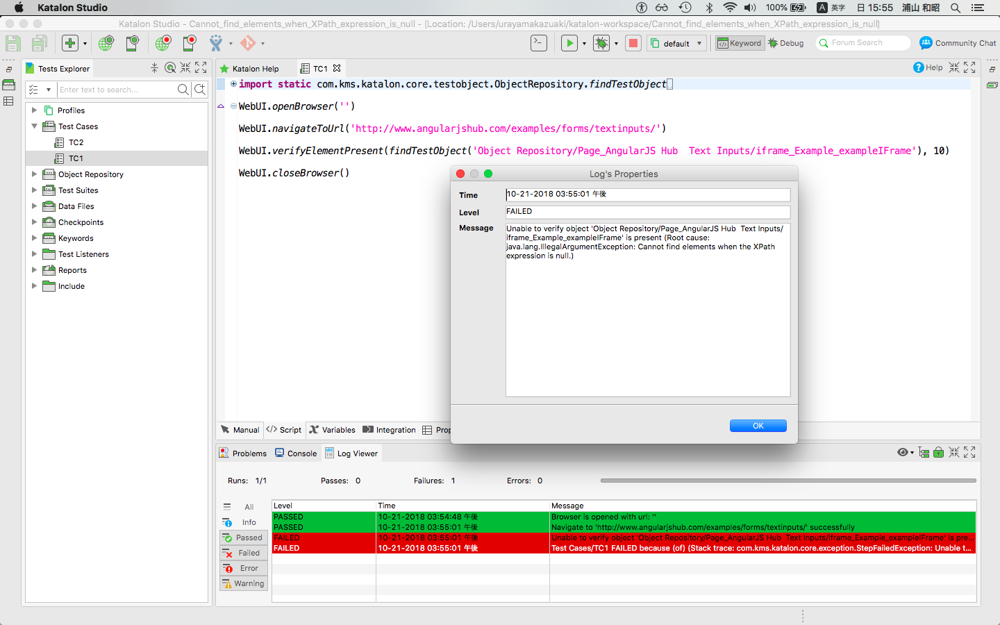
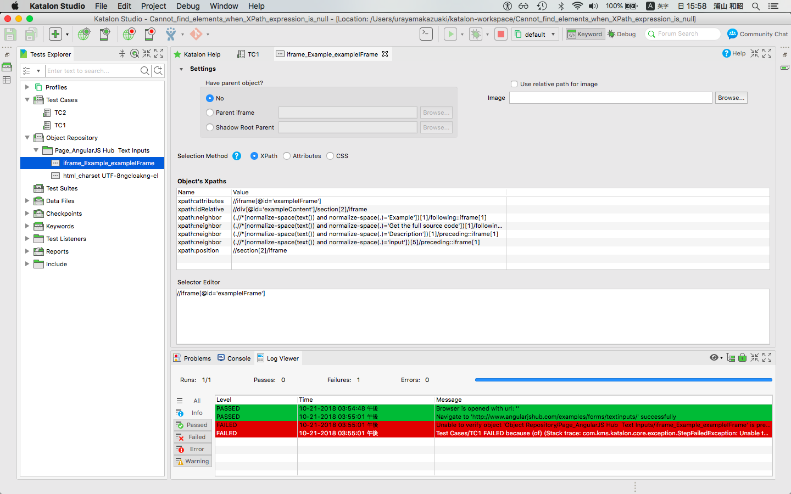

Message from Katalon Studio 5.7 "Cannot find elements when XPath expression is null" reproduced
===============

This is simple Katalon Studio project to report a bug in Katalon Studio 5.7.

OS: Mac OS 10.13.6 High Siearra

Katalon Studio: version 5.7.1

## How to reporoduce the insident

1. git clone [this project](https://github.com/kazurayam/Cannot_find_elements_when_XPath_expression_is_null) or
download ZIP form the [relases](https://github.com/kazurayam/Cannot_find_elements_when_XPath_expression_is_null/releases) page.
2. open the project with Katalon Studio v5.7.0 or higher.
3. open Test Caset/TC1 and execute it. The source is as follows:
```
import static com.kms.katalon.core.testobject.ObjectRepository.findTestObject

import com.kms.katalon.core.webui.keyword.WebUiBuiltInKeywords as WebUI

WebUI.openBrowser('')

WebUI.navigateToUrl('http://www.angularjshub.com/examples/forms/textinputs/')

WebUI.verifyElementPresent(findTestObject('Object Repository/Page_AngularJS Hub  Text Inputs/iframe_Example_exampleIFrame'), 10)

WebUI.closeBrowser()
```

The test case will fail with the following message:

## What is expected
The test case should pass.

## What Actually occurs

The test case fails.
```
Unable to verify object 'Object Repository/Page_AngularJS Hub  Text Inputs/iframe_Example_exampleIFrame' is present
  (Root cause: java.lang.IllegalArgumentException: Cannot find elements when the XPath expression is null.)
```


## My investigation

The Test Object 'Object Repository/Page_AngularJS Hub  Text Inputs/iframe_Example_exampleIFrame' was generated by the Spy Web. It has Selection Method: `XPath`, and it seems to have a valid Selector: `//iframe[@id='exampleIFrame']`.


But the message is saying that *'the XPath is null'. This is the point I am curious about.

I did 2 experiments.

### manually turned to Selector: Attributes

I changed manually the Test Object to have Selection Method: `Attributes` and set Selector by tag and id: `//iframe[@id = 'exampleIFrame']`.


When I ran the `Test Cases/TC1`, it PASSED.

### manually turned back to Selector: XPath

After this fist experiment, I changed mannually the Test Object to have Selection Method: `XPath`. It got a valid selector: `//iframe[@id='exampleIFrame']`. This is just the same as the one generated by Spy Web. When I ran the `Test Cases/TC1`, it PASSED.

Once passed, the `Test Cases/TC1` will PASS forever. The only way to make it FAIL again is to clone the project from [the GitHub repository](https://github.com/kazurayam/Cannot_find_elements_when_XPath_expression_is_null) and start fron scratch.

## Conclusion

I believe there is a small bug in Katalon Studion 5.7.

I believe that the message "Cannot find elements when XPath expression is null" started appearing since 5.7.0 which changed the specificaiton of Test Object: Selection method -- XPath, Attributes, CSS

I think that the Test Object was generated by Spy Web in a internal state somewhat incomplete, which caused the message *Cannot find elements when XPath expression is null* comes up. I manually edited the Test Object --- this operation seems to change the internal state, and hides the problem.

I guess that upgrading old version Katalon Studio to newer version (>=5.7.0) causes similar problem.

In the Katalon Forum I have seen a few posts reporting the same message.

- https://forum.katalon.com/discussion/comment/24523/#Comment_24523
- https://forum.katalon.com/discussion/10198/set-text-for-a--element--in-a-frame-reportcannot-find-elements-when-the-xpath-expression-is-null
- https://forum.katalon.com/discussion/10027/web-recorder-unable-to-go-into-an-iframe-object-to-enter-the-data-for-notes-web-studio-571
-
